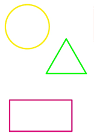
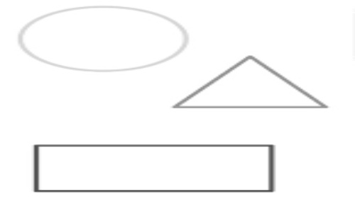
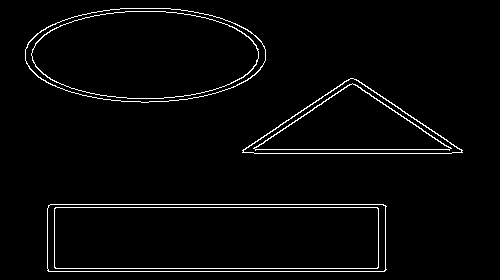
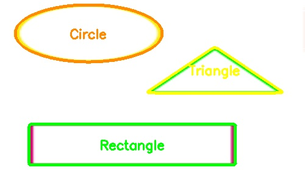

# Shape Detection System

A real-time shape detection system using OpenCV and Python that can identify various geometric shapes from camera feed or images.

## Demo


*Watch the system detect circles, triangles, squares, rectangles, and hexagons in real-time!*

## Image Processing Pipeline

The shape detection logic involves a sequence of image preprocessing steps before classification:

| Original Image | Grayscale | Blurred | Canny Edges | Final Output |
|----------------|-----------|---------|-------------|--------------|
|  |  |  |  |  |

## ✨ Features

- **Real-time Shape Detection**: Detect shapes from live camera feed
- **Multiple Shape Recognition**: 
  - Circles
  - Triangles
  - Squares
  - Rectangles
  - Hexagons
- **Color-coded Output**: Each shape type has its own distinct color
- **Image Processing**: Process static images for shape detection
- **Modular Design**: Separate modules for video capture and shape detection
- **DroidCam Support**: Works with DroidCam for mobile camera input

## Installation

### Prerequisites
- Python 3.7+
- OpenCV
- NumPy

### Setup
```bash
# Clone the repository
git clone https://github.com/yourusername/shape_detector.git
cd shape_detector

# Install dependencies
pip install opencv-python numpy
```

## Usage

### Live Camera Detection
```bash
python video_capture.py
```
- Press `'q'` to quit
- Press `'s'` to save current frame

### Image Processing
```bash
python shape_detection.py
```

### Testing with Sample Images
```bash
python sample.py
```

### Record Demo Video
```bash
python record_demo.py
```

## Project Structure

```
shape_detector/
├── shape_detection.py      # Main shape detection logic
├── video_capture.py        # Live camera processing
├── sample.py              # Testing with sample images
├── record_demo.py         # Demo video recording
├── test_images/           # Sample images for testing
│   ├── circle.jpg
│   ├── triangle.png
│   ├── square.png
│   ├── rectangle.png
│   └── hexagon.png
├── assets/
│   ├── test_images/       # Sample images for testing
│   │   ├── shapes.png
│   │   ├── circle.jpg
│   │   ├── triangle.png
│   │   ├── square.png
│   │   ├── rectangle.png
│   │   └── hexagon.png
│   └── output/            # Generated output files
│       ├── shape_detection_demo.mp4
│       ├── shape_detection_result.jpg
│       ├── preprocessing_grayscale.jpg
│       ├── preprocessing_blur.jpg
│       └── preprocessing_canny.jpg
└── README.md
```

## 🎯 How It Works

### Preprocessing Pipeline

1. **Grayscale Conversion**: Convert RGB image to grayscale
2. **Gaussian Blur**: Apply blur to reduce noise
3. **Canny Edge Detection**: Detect edges in the image
4. **Contour Detection**: Find contours from edges
5. **Shape Classification**: Classify shapes based on vertex count and aspect ratio

### Shape Classification Logic

- **Circle**: More than 7 vertices
- **Hexagon**: Exactly 6 vertices
- **Square**: 4 vertices with aspect ratio between 0.9-1.2
- **Rectangle**: 4 vertices with aspect ratio outside 0.9-1.2
- **Triangle**: Exactly 3 vertices

##  Configuration

You can adjust various parameters in `shape_detection.py`:
- `PIXELS_TO_MM`: Scale factor for measurements
- Contour area threshold (currently 50)
- Canny edge detection parameters (50, 50)
- Gaussian blur kernel size (7, 7)
- Shape classification thresholds


##  DroidCam Setup

To use DroidCam as your camera source:

1. Install DroidCam on your Android device
2. Install DroidCam Client on your PC
3. Connect both devices to the same WiFi network
4. Update the camera source in `video_capture.py`:
   ```python
   cap = cv2.VideoCapture('http://YOUR_PHONE_IP:4747/video')
   ```

## Testing

### Best Practices for Testing
- Use white paper with dark shapes for best contrast
- Ensure good lighting conditions
- Keep shapes at a reasonable distance from camera
- Use clean, well-drawn shapes for accurate detection

### Supported Image Formats
- JPG, PNG, BMP, and other OpenCV supported formats

## Contributing

1. Fork the repository
2. Create a feature branch (`git checkout -b feature/AmazingFeature`)
3. Commit your changes (`git commit -m 'Add some AmazingFeature'`)
4. Push to the branch (`git push origin feature/AmazingFeature`)
5. Open a Pull Request

## 🙏 Acknowledgments

- OpenCV community for computer vision tools
- Python community for excellent libraries
- DroidCam for mobile camera integration
- Contributors and testers

---

**Made with ❤️ for computer vision enthusiasts**

*This project demonstrates real-time shape detection using computer vision techniques and can be extended for various applications like object recognition, quality control, and educational purposes.*
